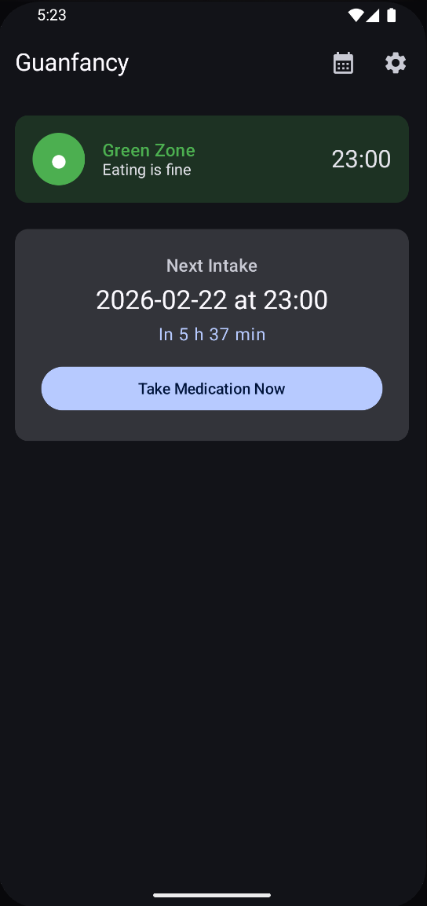
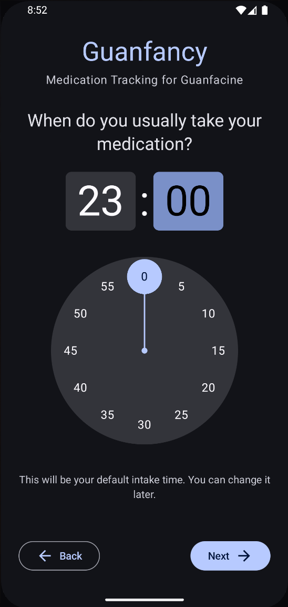
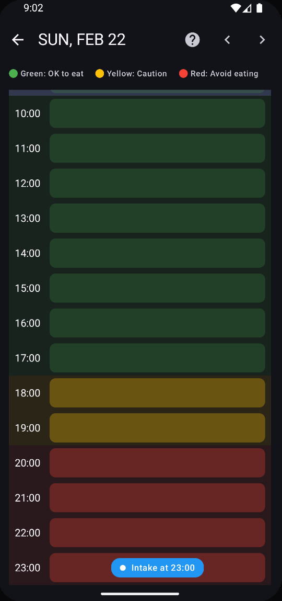

# Guanfancy!

**Personal Guanfacine Medication Tracker with Food Zone Timing**

```
I've created this project with support of opencode (https://github.com/anomalyco/opencode/) and GLM-5 (https://arxiv.org/pdf/2602.15763) as proof of concept how Agentic Engineering would work on a native Android Platform with Kotlin and Jetpack Compose.
```
⚠️ **Medical Disclaimer**
This app is NOT medical advice. It is a personal tracking tool only.

⚠️ **Development Information**
This app is under active development and may change rapidly. Bugs are to be expected.

### What does this app?

- **Track your Guanfacine intake** - Log when you take your medication with a single tap
- **Stay informed with Food Zone indicators** - See at a glance whether it's safe to eat (Green/Yellow/Red zones based on how food affects Guanfacine absorption)
- **Get adaptive scheduling** - The app adjusts your next intake time based on your feedback (feeling good, dizzy, or too dizzy)
- **Provide feedback after each dose** - Report how you felt to help optimize your schedule
- **View your intake history** - Browse a calendar with hourly timeline showing all past intakes and food zones
- **Receive reminders** - Get notifications for scheduled intake times and feedback prompts
- **Customize your schedule** - Configure intervals between intakes based on feedback type

**Scrennshots**
<p align="center">
    
    
    
</p>

### Supported Medications
 Intuniv (Extended Release)
- Max blood presence: ~6 hours
- Food zones: **Red for 3h**, Yellow for 5h after intake

 Tenex (Immediate Release)
- Max blood presence: ~3 hours  
- Food zones: **Red for 1.5h**, Yellow for 2.5h after intake

### Why this app?

Guanfacine absorption is affected by food. Taking it with high-fat meals can significantly alter how your body processes the medication. The food zones help you time your meals around your medication:
- **Green Zone**: Safe to eat normally
- **Yellow Zone**: Avoid large meals
- **Red Zone**: Don't eat

### Why dynamic intakes?

If you're sensitive to Guanfacine, finding the right dosage timing is crucial. The medication is therapeutic at lower concentrations but can become disruptive at higher levels—causing dizziness, fatigue, or blood pressure drops.
Guanfacine has a ~17 hour half-life, meaning it can accumulate in your system if taken too frequently. This app helps by **adjusting your next intake based on how you feel**.

### Tech Stack
- Kotlin 2.1.0
- Jetpack Compose + Material 3
- Hilt (DI)
- Room (local database)
- DataStore (preferences)
- WorkManager + AlarmManager (notifications)
- kotlinx-datetime

 Build & Run
```
./gradlew assembleDebug
```
*Requires Android SDK 35+.*
